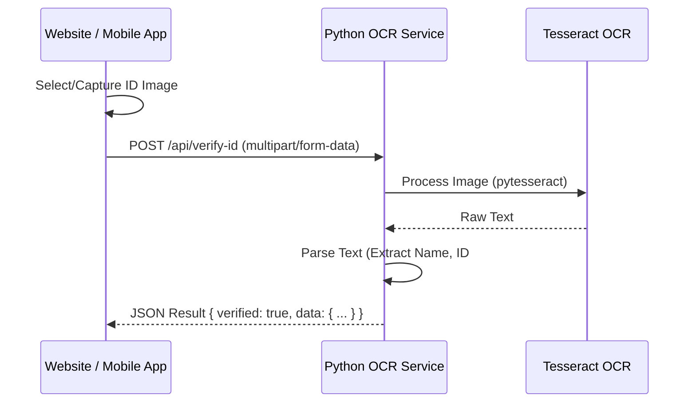

# ID Verification with PyTesseract Guide

This guide details how to integrate **PyTesseract** (Python Tesseract OCR) into your **Next.js Website** and **React Native Mobile App**.

Since your current stack is JavaScript-based (Next.js/React Native) and PyTesseract requires a Python environment, the best approach is to create a lightweight **Python Microservice**.

## 1. Architecture Overview

Both your Website and Mobile App will send images to a centralized Python API, which handles the heavy lifting of OCR.



## 2. Python Microservice Setup

Create a new folder `ocr-service` in your project root or a separate repository.

### Prerequisites
- Python 3.9+
- Tesseract OCR engine installed on the server (e.g., `apt-get install tesseract-ocr`).

### A. Requirements (`ocr-service/requirements.txt`)
```text
fastapi>=0.68.0
uvicorn>=0.15.0
python-multipart>=0.0.5
pytesseract>=0.3.8
Pillow>=8.3.2
numpy>=1.21.0
opencv-python-headless>=4.5.3  # Optional: For pre-processing images to improve accuracy
```

### B. The API Code (`ocr-service/main.py`)

This service takes an image, processes it, and attempts to extract ID information.

```python
from fastapi import FastAPI, File, UploadFile, HTTPException
from PIL import Image, ImageOps
import pytesseract
import io
import re

app = FastAPI()

# If Tesseract is not in your PATH, specify it here:
# pytesseract.pytesseract.tesseract_cmd = r'/usr/bin/tesseract'

def preprocess_image(image: Image.Image) -> Image.Image:
    """
    Convert to grayscale and threshold to improve OCR accuracy.
    """
    gray = ImageOps.grayscale(image)
    # Simple thresholding (binarization)
    threshold = gray.point(lambda p: 255 if p > 128 else 0)
    return threshold

def parse_id_card(text: str):
    """
    Analyze OCR text to find patterns like ID numbers.
    Customize regex for your specific ID type (e.g., Passport, National ID).
    """
    # Example: Looking for a generic 8-digit ID number
    id_pattern = r"\b\d{8}\b"
    
    # Example: Extracting potential names (very basic heuristic)
    # Allows generic scraping of lines that look like names (all caps, etc.)
    lines = [line.strip() for line in text.split('\n') if line.strip()]
    
    found_id = re.search(id_pattern, text)
    
    return {
        "raw_text": text,
        "extracted_id": found_id.group(0) if found_id else None,
        "lines": lines
    }

@app.post("/verify-id")
async def verify_id(file: UploadFile = File(...)):
    # 1. Validate File Type
    if file.content_type not in ["image/jpeg", "image/png"]:
        raise HTTPException(status_code=400, detail="Invalid file type. Only JPEG/PNG allowed.")

    try:
        # 2. Read Image
        contents = await file.read()
        image = Image.open(io.BytesIO(contents))

        # 3. Pre-process (Optional but recommended)
        processed_image = preprocess_image(image)

        # 4. Run PyTesseract
        # lang='eng' can be changed based on the ID language
        text = pytesseract.image_to_string(processed_image, lang='eng')

        # 5. Parse Data
        result = parse_id_card(text)
        
        return {
            "status": "success",
            "data": result
        }

    except Exception as e:
        return {"status": "error", "message": str(e)}

if __name__ == "__main__":
    import uvicorn
    uvicorn.run(app, host="0.0.0.0", port=8000)
```

### C. Dockerfile (Crucial for Deployment)

Since Tesseract is a C++ binary, you cannot just use `pip install`. You need a Docker container.

```dockerfile
FROM python:3.9-slim

# Install Tesseract OCR and system dependencies
RUN apt-get update && apt-get install -y \
    tesseract-ocr \
    libtesseract-dev \
    && rm -rf /var/lib/apt/lists/*

WORKDIR /app

COPY requirements.txt .
RUN pip install --no-cache-dir -r requirements.txt

COPY . .

CMD ["uvicorn", "main:app", "--host", "0.0.0.0", "--port", "8000"]
```

## 3. Integration with Next.js (Website)

Use a standard `FormData` upload.

```typescript
// components/id-verification-form.tsx
'use client';
import { useState } from 'react';

export default function IdVerification() {
  const [file, setFile] = useState<File | null>(null);
  const [result, setResult] = useState<any>(null);

  const handleVerify = async () => {
    if (!file) return;

    const formData = new FormData();
    formData.append('file', file);

    try {
      // Replace with your actual Python API URL
      const response = await fetch('https://your-python-api.com/verify-id', {
        method: 'POST',
        body: formData,
      });
      const data = await response.json();
      setResult(data);
    } catch (error) {
      console.error('Verification failed', error);
    }
  };

  return (
    <div className="space-y-4">
      <input 
        type="file" 
        accept="image/*" 
        onChange={(e) => setFile(e.target.files?.[0] || null)} 
      />
      <button 
        onClick={handleVerify}
        className="bg-blue-600 text-white px-4 py-2 rounded"
      >
        Verify ID
      </button>
      
      {result && (
        <pre className="bg-gray-100 p-4 rounded mt-4">
          {JSON.stringify(result, null, 2)}
        </pre>
      )}
    </div>
  );
}
```

## 4. Integration with Mobile (Expo/React Native)

You will use `expo-image-picker` to select the file and perform a multipart upload.

```typescript
// mobile/app/(tabs)/verify.tsx
import React, { useState } from 'react';
import { View, Button, Image, Text, Alert } from 'react-native';
import * as ImagePicker from 'expo-image-picker';

export default function VerifyScreen() {
  const [image, setImage] = useState<string | null>(null);
  const [result, setResult] = useState<any>(null);

  const pickImage = async () => {
    const result = await ImagePicker.launchImageLibraryAsync({
      mediaTypes: ImagePicker.MediaTypeOptions.Images,
      allowsEditing: true, // Cropping helps OCR accuracy!
      quality: 1,
    });

    if (!result.canceled) {
      setImage(result.assets[0].uri);
      uploadImage(result.assets[0].uri);
    }
  };

  const uploadImage = async (uri: string) => {
    const formData = new FormData();
    
    // React Native specific file object construction
    formData.append('file', {
      uri: uri,
      name: 'id_card.jpg',
      type: 'image/jpeg',
    } as any);

    try {
      const response = await fetch('https://your-python-api.com/verify-id', {
        method: 'POST',
        headers: {
          'Content-Type': 'multipart/form-data',
        },
        body: formData,
      });

      const data = await response.json();
      setResult(data);
    } catch (error) {
      Alert.alert('Error', 'Verification failed');
      console.error(error);
    }
  };

  return (
    <View className="flex-1 items-center justify-center p-4">
      <Button title="Pick ID Image" onPress={pickImage} />
      {image && (
        <Image source={{ uri: image }} className="w-64 h-40 mt-4 bg-gray-200" resizeMode="contain" />
      )}
      {result && (
        <Text className="mt-4 text-sm">
          Extracted Text: {result.data?.extracted_id || 'No ID found'}
        </Text>
      )}
    </View>
  );
}
```

## 5. Alternative: Client-Side (No Python Server)

If you strictly want to avoid a Python backend, you can use **Tesseract.js**.

1.  **Pros**: No server cost, easier deployment (just npm install).
2.  **Cons**: Slower (runs on user's device), huge bundle size, drains battery on mobile.
3.  **Usage**:
    *   Web: `npm install tesseract.js`
    *   Mobile: NOT recommended for heavy OCR. Use a native library like `react-native-vision-camera` (which uses MLKit/Google Vision) instead of Tesseract if going native.

**Verdict**: If "PyTesseract" is a strict requirement, follow the Python Microservice path above.
